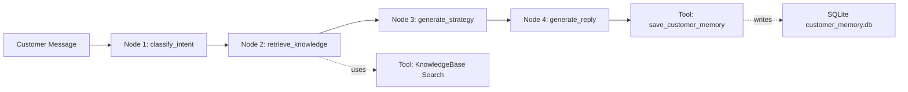

# Trade Agent: 简化版外贸谈判客服 Agent

这是一个面向 AI Agent / LLM 应用实习投递的最小可演示项目。它不追求复杂多 Agent，而是把一个真实业务问题讲清楚：

> 外贸客服在面对询价、砍价、样品、物流和投诉时，需要结合产品资料、报价策略、客户历史和下一步跟进动作，生成可控、可解释的回复。

## 项目亮点

- **RAG 知识库**：从 Markdown 产品资料、报价规则、物流政策、FAQ 中检索证据。
- **Agent 工作流**：固定 4 个节点：意图识别、知识检索、谈判策略、客服回复。
- **客户记忆**：用 SQLite 保存国家、预算、关注点、是否砍价、下一步动作。
- **结构化输出**：每次回复都展示 `intent`、`retrieved_policy`、`negotiation_strategy`、`suggested_reply`、`next_action`。
- **可解释日志**：保留每一步执行记录，方便面试讲 Agent 执行流。

## 架构图



## 快速运行

```bash
cd "E:\Code\StudyLLM\09. Agent\trade-agent"
python run_demo.py
```

运行 Streamlit 页面：

```bash
streamlit run app.py
```

## 三个演示 Case

### 1. 砍价 / 批量询价

输入：

```text
Can you give me a better price if I order 500 pieces?
```

预期：

- 识别为 `price_negotiation`
- 检索报价和 MOQ 政策
- 给出阶梯折扣建议
- 生成英文客服回复

### 2. 物流交期

输入：

```text
How long does shipping to the US take?
```

预期：

- 识别为 `shipping`
- 检索美国运输时效
- 回复交期和跟进动作

### 3. 样品请求

输入：

```text
Can I get a sample before bulk order?
```

预期：

- 识别为 `sample_request`
- 检索样品政策
- 提醒确认收货地址和目标规格

## Agent 执行流程

1. **classify_intent**：用关键词和规则识别客户意图，抽取国家、数量、预算等线索。
2. **retrieve_knowledge**：用轻量 BM25 风格检索，从业务文档中找证据。
3. **generate_strategy**：根据意图、订单数量、政策和历史记忆生成销售策略。
4. **generate_reply**：生成英文客服回复，同时保存下一步动作。

## 为什么不是普通 Chatbot

普通 Chatbot 容易直接生成看似合理的回复，但有三个风险：

- 不知道报价底线，容易乱让价。
- 不记录客户历史，下一轮无法延续谈判。
- 不展示依据，业务人员无法判断回复是否可靠。

本项目用 RAG、结构化策略和客户记忆解决这些问题。

## 当前不足和下一步

- 当前默认使用规则和模板生成，方便无 API Key 环境演示；后续可接入 OpenAI-compatible API。
- 检索是轻量实现，后续可替换为 FAISS / Milvus / BGE-M3。
- 工作流是手写 Graph Runner，后续可替换为 LangGraph `StateGraph`。
- 可加入报价审批节点，防止 Agent 自动给出超权限折扣。

## 面试 1 分钟讲法

这个项目模拟外贸谈判客服场景。客户消息进来后，Agent 先识别意图，比如砍价、物流、样品；然后从产品、价格、物流、FAQ 文档中检索依据；再结合客户历史和业务规则生成销售策略，最后输出英文客服回复和下一步跟进动作。相比普通客服 Bot，它多了 RAG 证据、客户记忆、结构化策略和执行日志，因此更适合真实销售/客服场景。
